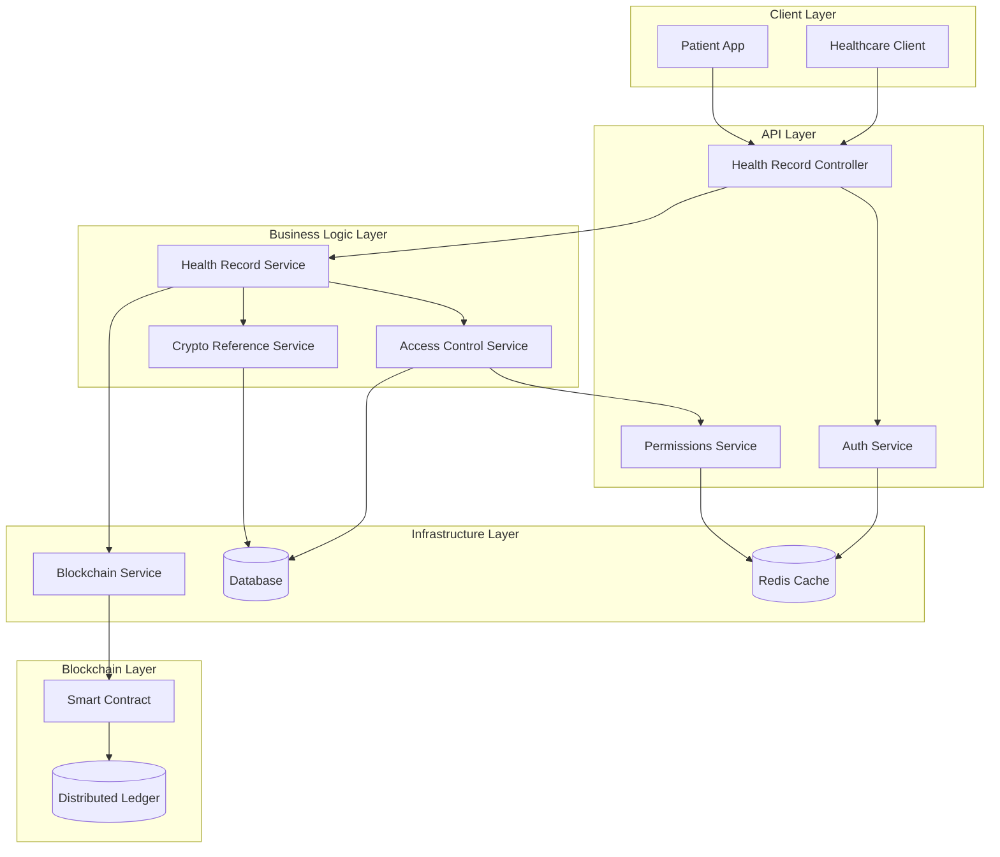

# Design Document: Health Record Implementation

## Overview

This design addresses the implementation of proper health record methods in the LifeBank blockchain contract system. Currently, the contract contains stubbed methods (`store_record`, `get_record`, and `verify_access`) that provide placeholder functionality without meaningful storage, access control, or privacy protection. This design provides two implementation paths: complete removal of these methods or full implementation with proper security, privacy, and storage semantics.

The design follows a privacy-first approach where sensitive health data never touches the blockchain directly. Instead, the system stores cryptographic references (hashes or encrypted pointers) that can be used to locate and verify health records stored in secure, off-chain systems while maintaining an immutable audit trail on the blockchain.

## Architecture

### High-Level Architecture

The health record system follows a layered architecture that integrates with the existing LifeBank blockchain infrastructure:



### Contract Domain Integration

The health record functionality will be added as a new domain in the existing contract boundaries:

```typescript
export const LIFEBANK_CONTRACT_BOUNDARIES = {
  // ... existing domains
  healthRecords: {
    sourceOfTruth: 'lifebank-soroban/contracts/health-records',
    methods: {
      storeRecord: 'store_record',
      getRecord: 'get_record', 
      verifyAccess: 'verify_access',
      revokeAccess: 'revoke_access',
      updatePermissions: 'update_permissions',
    },
  },
} as const;
```

## Components and Interfaces

### Health Record Service

The core service responsible for orchestrating health record operations:

```typescript
interface HealthRecordService {
  storeRecord(request: StoreRecordRequest): Promise<StoreRecordResponse>;
  getRecord(request: GetRecordRequest): Promise<GetRecordResponse>;
  verifyAccess(request: VerifyAccessRequest): Promise<VerifyAccessResponse>;
  revokeAccess(request: RevokeAccessRequest): Promise<void>;
  updatePermissions(request: UpdatePermissionsRequest): Promise<void>;
}

interface StoreRecordRequest {
  patientId: string;
  recordHash: string;
  metadata: RecordMetadata;
  authorizedProviders: string[];
}

interface GetRecordRequest {
  patientId: string;
  providerId: string;
  requestContext: RequestContext;
}

interface VerifyAccessRequest {
  patientId: string;
  providerId: string;
  operation: 'read' | 'write';
}
```

### Access Control Service

Manages authorization and permission enforcement:

```typescript
interface AccessControlService {
  checkAccess(patientId: string, providerId: string, operation: string): Promise<boolean>;
  grantAccess(patientId: string, providerId: string, permissions: Permission[]): Promise<void>;
  revokeAccess(patientId: string, providerId: string): Promise<void>;
  listAuthorizedProviders(patientId: string): Promise<AuthorizedProvider[]>;
  auditAccess(event: AccessEvent): Promise<void>;
}

interface Permission {
  operation: 'read' | 'write' | 'share';
  expiresAt?: Date;
  conditions?: AccessCondition[];
}

interface AccessEvent {
  patientId: string;
  providerId: string;
  operation: string;
  result: 'granted' | 'denied';
  timestamp: Date;
  metadata?: Record<string, unknown>;
}
```

### Crypto Reference Service

Handles cryptographic operations for privacy-preserving references:

```typescript
interface CryptoReferenceService {
  generateRecordHash(recordData: RecordData): Promise<string>;
  encryptReference(reference: string, key: string): Promise<string>;
  decryptReference(encryptedRef: string, key: string): Promise<string>;
  validateHash(recordData: RecordData, hash: string): Promise<boolean>;
  rotateKeys(patientId: string): Promise<KeyRotationResult>;
}

interface RecordData {
  content: Buffer;
  contentType: string;
  checksum: string;
}

interface KeyRotationResult {
  oldKeyId: string;
  newKeyId: string;
  reencryptedReferences: string[];
}
```

## Data Models

### Health Record Reference Entity

```typescript
@Entity('health_record_references')
export class HealthRecordReferenceEntity {
  @PrimaryGeneratedColumn('uuid')
  id: string;

  @Column({ name: 'patient_id', type: 'uuid' })
  @Index()
  patientId: string;

  @Column({ name: 'record_hash', type: 'varchar', length: 128 })
  @Index()
  recordHash: string;

  @Column({ name: 'encrypted_reference', type: 'text', nullable: true })
  encryptedReference?: string;

  @Column({ name: 'key_id', type: 'varchar', length: 64 })
  keyId: string;

  @Column({ name: 'content_type', type: 'varchar', length: 100 })
  contentType: string;

  @Column({ name: 'metadata', type: 'jsonb', nullable: true })
  metadata?: RecordMetadata;

  @Column({ name: 'blockchain_tx_hash', type: 'varchar', length: 128, nullable: true })
  blockchainTxHash?: string;

  @CreateDateColumn({ name: 'created_at' })
  createdAt: Date;

  @UpdateDateColumn({ name: 'updated_at' })
  updatedAt: Date;

  @DeleteDateColumn({ name: 'deleted_at', nullable: true })
  deletedAt?: Date;
}
```

### Access Control List Entity

```typescript
@Entity('health_record_acl')
export class HealthRecordAclEntity {
  @PrimaryGeneratedColumn('uuid')
  id: string;

  @Column({ name: 'patient_id', type: 'uuid' })
  @Index()
  patientId: string;

  @Column({ name: 'provider_id', type: 'uuid' })
  @Index()
  providerId: string;

  @Column({ name: 'permissions', type: 'simple-array' })
  permissions: string[];

  @Column({ name: 'granted_by', type: 'uuid' })
  grantedBy: string;

  @Column({ name: 'expires_at', type: 'timestamp', nullable: true })
  expiresAt?: Date;

  @Column({ name: 'conditions', type: 'jsonb', nullable: true })
  conditions?: AccessCondition[];

  @CreateDateColumn({ name: 'created_at' })
  createdAt: Date;

  @UpdateDateColumn({ name: 'updated_at' })
  updatedAt: Date;

  @DeleteDateColumn({ name: 'deleted_at', nullable: true })
  deletedAt?: Date;

  @Index(['patientId', 'providerId'], { unique: true })
  static readonly UNIQUE_PATIENT_PROVIDER = 'UQ_PATIENT_PROVIDER';
}
```

### Access Audit Log Entity

```typescript
@Entity('health_record_access_log')
export class HealthRecordAccessLogEntity {
  @PrimaryGeneratedColumn('uuid')
  id: string;

  @Column({ name: 'patient_id', type: 'uuid' })
  @Index()
  patientId: string;

  @Column({ name: 'provider_id', type: 'uuid' })
  @Index()
  providerId: string;

  @Column({ name: 'record_id', type: 'uuid', nullable: true })
  recordId?: string;

  @Column({ name: 'operation', type: 'varchar', length: 50 })
  operation: string;

  @Column({ name: 'result', type: 'varchar', length: 20 })
  result: 'granted' | 'denied';

  @Column({ name: 'ip_address', type: 'inet', nullable: true })
  ipAddress?: string;

  @Column({ name: 'user_agent', type: 'text', nullable: true })
  userAgent?: string;

  @Column({ name: 'metadata', type: 'jsonb', nullable: true })
  metadata?: Record<string, unknown>;

  @CreateDateColumn({ name: 'created_at' })
  @Index()
  createdAt: Date;
}
```

### Supporting Types

```typescript
interface RecordMetadata {
  recordType: string;
  size: number;
  checksum: string;
  createdBy: string;
  tags?: string[];
  externalSystemId?: string;
}

interface AccessCondition {
  type: 'time_window' | 'location' | 'purpose' | 'emergency';
  value: unknown;
  operator: 'eq' | 'in' | 'between' | 'exists';
}

interface RequestContext {
  ipAddress?: string;
  userAgent?: string;
  sessionId?: string;
  emergencyOverride?: boolean;
}
```
## Correctness Properties

*A property is a characteristic or behavior that should hold true across all valid executions of a system-essentially, a formal statement about what the system should do. Properties serve as the bridge between human-readable specifications and machine-verifiable correctness guarantees.*

Before defining the correctness properties, I need to analyze the acceptance criteria from the requirements document to determine which are testable as properties.

### Property 1: Privacy-Preserving Storage

*For any* valid record reference and associated metadata, when stored in the system, the storage layer should persist only cryptographic hashes or encrypted references, never raw health record data, and maintain referential integrity between Patient_ID and stored references.

**Validates: Requirements 2.1, 2.2, 2.4, 5.1, 5.2**

### Property 2: Input Validation and Authorization

*For any* record storage request, the system should validate the Patient_ID format and verify authorization before allowing the storage operation to proceed.

**Validates: Requirements 2.3**

### Property 3: Access Control Verification

*For any* Provider_ID requesting access to a Patient_ID record, the Access_Controller should verify authorization before granting access and maintain the access control list mapping correctly.

**Validates: Requirements 3.1, 3.2**

### Property 4: Unauthorized Access Denial

*For any* unauthorized Provider_ID attempting to access a Patient_ID record, the system should deny the request and log the attempt for audit purposes.

**Validates: Requirements 3.3, 4.2**

### Property 5: Authorized Record Retrieval

*For any* authorized Provider_ID requesting an existing Patient_ID record, the system should return the Privacy_Preserving_Reference along with complete metadata including creation timestamp and last access time.

**Validates: Requirements 4.1, 4.4**

### Property 6: Invalid Record Handling

*For any* request for a non-existent Patient_ID, the system should return a record-not-found error consistently.

**Validates: Requirements 4.3**

### Property 7: Comprehensive Audit Logging

*For any* record access event (whether granted or denied), the system should log the event with complete audit information including timestamp, Provider_ID, and operation result.

**Validates: Requirements 3.4, 4.5**

### Property 8: Round-Trip Record Integrity

*For any* record reference stored by an authorized user, when retrieved by an authorized Provider_ID, the returned Privacy_Preserving_Reference should be equivalent to the originally stored reference.

**Validates: Requirements 7.5**

## Error Handling

The health record system implements comprehensive error handling across all operational scenarios:

### Error Categories

1. **Authentication Errors**
   - Invalid or expired tokens
   - Missing authentication credentials
   - Account lockout or suspension

2. **Authorization Errors**
   - Insufficient permissions for requested operation
   - Expired access grants
   - Patient consent withdrawal

3. **Validation Errors**
   - Invalid Patient_ID or Provider_ID format
   - Malformed record references
   - Missing required metadata

4. **System Errors**
   - Storage capacity exceeded
   - Blockchain transaction failures
   - Cryptographic operation failures

5. **Business Logic Errors**
   - Record not found
   - Duplicate record references
   - Conflicting access permissions

### Error Response Format

All errors follow a consistent structure for client handling:

```typescript
interface HealthRecordError {
  code: string;
  message: string;
  details?: Record<string, unknown>;
  timestamp: string;
  requestId: string;
}
```

### Error Handling Strategies

1. **Graceful Degradation**: System continues operating with reduced functionality when non-critical components fail
2. **Circuit Breaker Pattern**: Prevents cascade failures by temporarily disabling failing services
3. **Retry Logic**: Automatic retry with exponential backoff for transient failures
4. **Audit Trail**: All errors are logged with sufficient context for debugging and security analysis

## Testing Strategy

The health record implementation follows a dual testing approach combining unit tests and property-based tests for comprehensive coverage.

### Property-Based Testing

Property-based tests verify the universal properties defined in the Correctness Properties section. Each property test will:

- Run a minimum of 100 iterations with randomized inputs
- Generate diverse test scenarios including edge cases
- Verify the property holds across all valid input combinations
- Use the fast-check library for TypeScript property-based testing

**Property Test Configuration:**
```typescript
// Example property test structure
describe('Health Record Properties', () => {
  it('Property 1: Privacy-Preserving Storage', async () => {
    await fc.assert(
      fc.asyncProperty(
        recordReferenceArbitrary(),
        metadataArbitrary(),
        async (recordRef, metadata) => {
          const result = await healthRecordService.storeRecord({
            patientId: recordRef.patientId,
            recordHash: recordRef.hash,
            metadata,
            authorizedProviders: recordRef.providers
          });
          
          // Verify only hashes/encrypted refs are stored
          const stored = await storageLayer.getStoredData(result.id);
          expect(stored.containsRawHealthData).toBe(false);
          expect(stored.isHashOrEncrypted).toBe(true);
        }
      ),
      { numRuns: 100 }
    );
  });
});
```

Each property test must include a comment tag referencing its design property:
**Feature: health-record-implementation, Property 1: Privacy-Preserving Storage**

### Unit Testing

Unit tests complement property tests by focusing on:

- **Specific Examples**: Concrete scenarios that demonstrate correct behavior
- **Edge Cases**: Boundary conditions and error scenarios
- **Integration Points**: Interactions between components
- **Error Conditions**: Specific error handling scenarios

**Unit Test Categories:**

1. **Service Layer Tests**
   - Health Record Service operations
   - Access Control Service authorization logic
   - Crypto Reference Service operations

2. **Controller Tests**
   - HTTP endpoint behavior
   - Request/response validation
   - Authentication integration

3. **Repository Tests**
   - Database operations
   - Entity relationships
   - Query performance

4. **Integration Tests**
   - End-to-end workflows
   - Blockchain integration
   - External service interactions

### Test Data Management

- **Test Isolation**: Each test uses isolated data to prevent interference
- **Data Factories**: Consistent test data generation using factory patterns
- **Cleanup**: Automatic cleanup of test data after each test run
- **Anonymization**: Test data uses anonymized or synthetic health information

### Performance Testing

- **Load Testing**: Verify system performance under expected load
- **Stress Testing**: Identify breaking points and failure modes
- **Blockchain Performance**: Test transaction throughput and confirmation times
- **Database Performance**: Query optimization and indexing validation