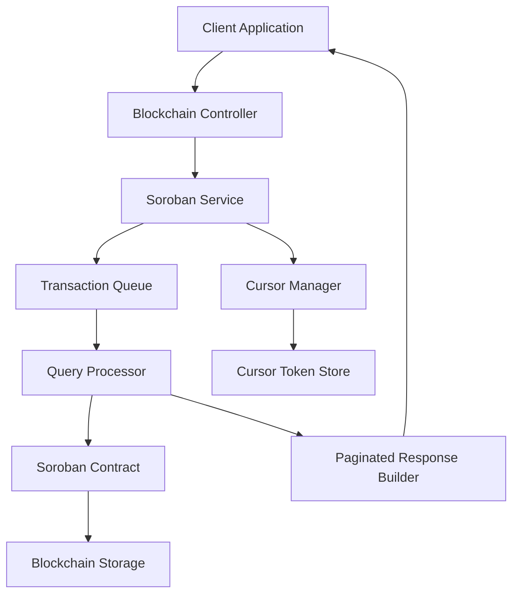

# Design Document: Query Pagination

## Overview

This design implements cursor-based pagination for blockchain query methods in the Lifebank system to address production risks from unbounded result sets. The current implementation includes query methods that return unbounded vectors from storage scans, creating ledger cost and response size issues as blockchain state grows.

The solution introduces paginated variants of existing query methods with deterministic ordering, secure cursor tokens, and bounded result sets. This enables safe traversal of large datasets by off-chain indexers and backend services while maintaining backward compatibility.

### Key Design Principles

- **Bounded Results**: All queries limited to maximum 100 items per request
- **Deterministic Ordering**: Consistent result ordering across repeated reads
- **Secure Cursors**: Tamper-resistant, opaque cursor tokens with expiration
- **Backward Compatibility**: Existing methods maintained with deprecation warnings
- **Performance**: Efficient pagination without full dataset scans

## Architecture

### High-Level Architecture

The pagination system extends the existing Soroban transaction queue architecture with new paginated query methods. The design maintains the current job-based approach while adding pagination-specific data structures and cursor management.



### Component Interactions

1. **Client** submits paginated query request with optional cursor
2. **Controller** validates request parameters and cursor token
3. **Service** creates pagination job and manages cursor lifecycle
4. **Cursor Manager** validates, decodes, and generates cursor tokens
5. **Query Processor** executes bounded queries with deterministic ordering
6. **Response Builder** constructs paginated response with next cursor

## Components and Interfaces

### Core Interfaces

#### Paginated Query Request
```typescript
interface PaginatedQueryRequest {
  method: string;
  filters: Record<string, unknown>;
  cursor?: string;
  pageSize?: number; // max 100, default 50
}
```

#### Paginated Query Response
```typescript
interface PaginatedQueryResponse<T> {
  data: T[];
  pagination: {
    nextCursor: string | null;
    hasMore: boolean;
    totalCount?: number;
  };
  metadata: {
    queryTime: number;
    resultCount: number;
  };
}
```

#### Cursor Token Structure
```typescript
interface CursorToken {
  queryMethod: string;
  lastKey: string; // ordering key of last item
  filters: Record<string, unknown>;
  timestamp: number;
  signature: string;
}
```

### Service Layer Components

#### Cursor Manager Service
```typescript
@Injectable()
export class CursorManager {
  generateCursor(queryContext: QueryContext, lastItem: unknown): string;
  validateCursor(cursor: string, queryMethod: string): CursorToken;
  isExpired(cursor: CursorToken): boolean;
}
```

#### Paginated Query Service
```typescript
@Injectable()
export class PaginatedQueryService {
  async queryInventoryPaginated(request: InventoryQueryRequest): Promise<PaginatedQueryResponse<InventoryItem>>;
  async queryRequestsPaginated(request: RequestQueryRequest): Promise<PaginatedQueryResponse<RequestItem>>;
  async queryDisputesPaginated(request: DisputeQueryRequest): Promise<PaginatedQueryResponse<DisputeItem>>;
  async getUnitTrailPaginated(request: TrailQueryRequest): Promise<PaginatedQueryResponse<TrailEvent>>;
  async getVerificationEventsPaginated(request: VerificationQueryRequest): Promise<PaginatedQueryResponse<VerificationEvent>>;
}
```

### Contract Interface Extensions

#### New Soroban Contract Methods
```rust
// Inventory queries
pub fn query_inventory_paginated(
    env: Env,
    blood_type: Option<String>,
    region: Option<String>,
    cursor: Option<String>,
    limit: u32,
) -> Result<PaginatedInventoryResponse, Error>;

// Request queries  
pub fn query_requests_paginated(
    env: Env,
    hospital_id: Option<String>,
    status: Option<RequestStatus>,
    cursor: Option<String>,
    limit: u32,
) -> Result<PaginatedRequestResponse, Error>;

// Dispute queries
pub fn query_disputes_paginated(
    env: Env,
    status: Option<DisputeStatus>,
    organization_id: Option<String>,
    start_date: Option<u64>,
    end_date: Option<u64>,
    cursor: Option<String>,
    limit: u32,
) -> Result<PaginatedDisputeResponse, Error>;

// Custody trail queries
pub fn get_unit_trail_paginated(
    env: Env,
    unit_id: String,
    cursor: Option<String>,
    limit: u32,
) -> Result<PaginatedTrailResponse, Error>;

// Verification event queries
pub fn get_verification_events_paginated(
    env: Env,
    organization_id: Option<String>,
    event_type: Option<VerificationEventType>,
    cursor: Option<String>,
    limit: u32,
) -> Result<PaginatedVerificationResponse, Error>;
```

## Data Models

### Query-Specific Data Models

#### Inventory Item
```typescript
interface InventoryItem {
  unitId: string;
  bloodType: string;
  region: string;
  quantity: number;
  expirationDate: number;
  status: InventoryStatus;
}
```

#### Request Item
```typescript
interface RequestItem {
  requestId: string;
  hospitalId: string;
  status: RequestStatus;
  items: BloodRequestItem[];
  createdAt: number;
  updatedAt: number;
}
```

#### Dispute Item
```typescript
interface DisputeItem {
  disputeId: string;
  organizationId: string;
  status: DisputeStatus;
  reason: string;
  createdAt: number;
  resolvedAt?: number;
}
```

#### Trail Event
```typescript
interface TrailEvent {
  eventId: string;
  unitId: string;
  eventType: 'custody_transfer' | 'temperature_log' | 'status_change';
  timestamp: number;
  data: CustodyTransfer | TemperatureLog | StatusChange;
}
```

#### Verification Event
```typescript
interface VerificationEvent {
  eventId: string;
  organizationId: string;
  eventType: VerificationEventType;
  timestamp: number;
  metadata: {
    licenseNumber?: string;
    verifierId?: string;
    reason?: string;
  };
}
```

### Cursor Token Encoding

Cursor tokens use JWT-like structure with HMAC-SHA256 signing:

```
cursor = base64url(header) + "." + base64url(payload) + "." + base64url(signature)

header = {
  "alg": "HS256",
  "typ": "cursor"
}

payload = {
  "method": "query_inventory_paginated",
  "lastKey": "unit_12345",
  "filters": {"bloodType": "O+", "region": "US-CA"},
  "exp": 1708123456
}
```

### Ordering Keys by Query Type

- **Inventory**: `unit_id` (ascending)
- **Requests**: `request_timestamp, request_id` (ascending)
- **Disputes**: `dispute_timestamp, dispute_id` (ascending)  
- **Custody Trail**: `event_timestamp, event_id` (ascending)
- **Verification Events**: `event_timestamp, event_id` (ascending)

## Error Handling

### Error Types and Responses

#### Cursor Validation Errors
```typescript
interface CursorError {
  code: 'INVALID_CURSOR' | 'EXPIRED_CURSOR' | 'TAMPERED_CURSOR';
  message: string;
  details?: {
    expectedMethod?: string;
    actualMethod?: string;
    expiredAt?: number;
  };
}
```

#### Query Parameter Errors
```typescript
interface QueryError {
  code: 'INVALID_PAGE_SIZE' | 'INVALID_FILTER' | 'MISSING_REQUIRED_PARAM';
  message: string;
  details?: {
    maxPageSize?: number;
    validValues?: string[];
  };
}
```

### Error Handling Strategy

1. **Cursor Validation**
   - Invalid cursor format: Return 400 with INVALID_CURSOR error
   - Expired cursor: Return 400 with EXPIRED_CURSOR error  
   - Tampered cursor: Return 400 with TAMPERED_CURSOR error
   - Cross-query cursor usage: Return 400 with INVALID_CURSOR error

2. **Parameter Validation**
   - Page size > 100: Return 400 with INVALID_PAGE_SIZE error
   - Invalid filter values: Return 400 with INVALID_FILTER error
   - Missing required parameters: Return 400 with MISSING_REQUIRED_PARAM error

3. **Blockchain Errors**
   - Contract execution failure: Return 500 with retry guidance
   - Network timeout: Return 503 with retry-after header
   - Rate limiting: Return 429 with retry-after header

4. **Graceful Degradation**
   - If cursor is expired but query is valid, restart from beginning
   - If blockchain is temporarily unavailable, return cached results with warning
   - If query takes too long, return partial results with continuation cursor

### Error Response Format
```typescript
interface ErrorResponse {
  error: {
    code: string;
    message: string;
    details?: Record<string, unknown>;
  };
  timestamp: string;
  requestId: string;
}
```

## Testing Strategy

### Dual Testing Approach

The testing strategy combines unit tests for specific scenarios and property-based tests for comprehensive coverage of pagination behavior across all input variations.

#### Unit Testing Focus
- Specific cursor validation scenarios (expired, tampered, invalid format)
- Edge cases (empty results, single item, exact page boundary)
- Error conditions (invalid parameters, blockchain failures)
- Integration points between cursor manager and query service
- Backward compatibility with existing non-paginated methods

#### Property-Based Testing Focus
- Universal pagination properties across all query types
- Cursor generation and validation round-trip properties
- Deterministic ordering consistency across multiple reads
- Filter application correctness across randomized datasets
- Comprehensive input coverage through randomized test data

### Property-Based Testing Configuration

**Testing Library**: fast-check (JavaScript/TypeScript property-based testing)
**Test Configuration**: Minimum 100 iterations per property test
**Test Tagging**: Each property test references its design document property

Example property test structure:
```typescript
import fc from 'fast-check';

describe('Query Pagination Properties', () => {
  it('Property 1: Pagination preserves total item count', () => {
    // Feature: query-pagination, Property 1: For any valid query filters...
    fc.assert(fc.property(
      fc.record({...}), // arbitrary query filters
      async (filters) => {
        // Test implementation
      }
    ), { numRuns: 100 });
  });
});
```

### Test Data Generation

**Randomized Test Data**:
- Blood types: A+, A-, B+, B-, AB+, AB-, O+, O-
- Regions: US-CA, US-NY, US-TX, EU-DE, EU-FR, etc.
- Timestamps: Random dates within realistic ranges
- Status values: All valid enum values for each entity type
- Organization IDs: UUID format with realistic patterns

**Edge Case Coverage**:
- Empty result sets
- Single item results  
- Results exactly at page boundaries (50, 100 items)
- Maximum timestamp values
- Minimum/maximum quantity values
- Special characters in string fields
## Correctness Properties

*A property is a characteristic or behavior that should hold true across all valid executions of a system-essentially, a formal statement about what the system should do. Properties serve as the bridge between human-readable specifications and machine-verifiable correctness guarantees.*

### Property 1: Bounded Result Sets

*For any* query method and any valid parameters, the response SHALL contain at most 100 items regardless of the total number of matching records in the system.

**Validates: Requirements 1.1, 1.2, 9.2**

### Property 2: Page Size Validation

*For any* query request with a page size parameter exceeding 100, the system SHALL reject the request with an appropriate error response.

**Validates: Requirements 1.3**

### Property 3: Cursor Round-Trip Integrity

*For any* valid query that returns a next_cursor, using that cursor in a subsequent request SHALL return results starting after the last item from the previous response, with no gaps or overlaps.

**Validates: Requirements 2.2, 2.3**

### Property 4: Pagination Metadata Consistency

*For any* query response, when more results are available the next_cursor field SHALL be present and non-null, and when no more results are available the next_cursor field SHALL be null.

**Validates: Requirements 2.1, 2.4**

### Property 5: Cursor Security and Validation

*For any* invalid, expired, or tampered cursor token, the system SHALL reject the request with an appropriate error and SHALL not expose internal database identifiers in valid cursor tokens.

**Validates: Requirements 2.5, 10.1, 10.3, 10.4, 10.5**

### Property 6: Deterministic Ordering Consistency

*For any* query method executed multiple times with identical parameters, the results SHALL be returned in the same deterministic order based on the specified ordering keys for each query type.

**Validates: Requirements 3.1, 3.2, 3.3, 3.4, 3.5**

### Property 7: Filter Application Correctness

*For any* query with filter parameters (blood_type, region, hospital_id, status, organization_id, event_type, date ranges), all returned results SHALL match the specified filter criteria exactly.

**Validates: Requirements 4.2, 4.3, 5.2, 5.3, 6.2, 6.3, 6.5, 8.3, 8.4**

### Property 8: Response Schema Compliance

*For any* query response, the returned items SHALL contain all required fields as specified for each query type (inventory, requests, disputes, custody trails, verification events) with correct data types and non-null values where required.

**Validates: Requirements 4.4, 5.4, 6.4, 7.2, 7.3, 7.4, 8.2, 8.5**

### Property 9: Pagination Metadata Completeness

*For any* paginated query response, the pagination metadata SHALL include accurate information about result counts, page availability, and total counts where specified for each query type.

**Validates: Requirements 4.5, 5.5**

### Property 10: Cursor Context Binding

*For any* cursor token generated by one query method, attempting to use that cursor with a different query method SHALL result in rejection with an appropriate error.

**Validates: Requirements 10.2**

### Property 11: Custody Trail Event Grouping

*For any* custody trail query, results SHALL be grouped by event type while maintaining chronological ordering within and across event types.

**Validates: Requirements 7.5**

### Property 12: Legacy Method Compatibility

*For any* existing non-paginated query method, the method SHALL continue to function with results limited to 100 items and SHALL generate appropriate usage logs for monitoring.

**Validates: Requirements 9.1, 9.2, 9.4**

### Property 13: Empty Result Handling

*For any* query that matches no records, the response SHALL return an empty array with null pagination metadata.

**Validates: Requirements 1.4**
## Implementation Considerations

### Performance Optimizations

1. **Index Strategy**
   - Create composite indexes on ordering keys for each query type
   - Ensure indexes support efficient cursor-based pagination
   - Monitor query performance and adjust indexes as needed

2. **Cursor Token Caching**
   - Cache cursor validation results to reduce cryptographic overhead
   - Implement cursor token pooling for frequently used query patterns
   - Use efficient serialization for cursor token encoding/decoding

3. **Query Optimization**
   - Implement query result caching for frequently accessed data
   - Use connection pooling for blockchain queries
   - Batch multiple cursor validations when possible

### Security Considerations

1. **Cursor Token Security**
   - Use HMAC-SHA256 for cursor token signing
   - Rotate signing keys periodically
   - Implement rate limiting on cursor validation attempts

2. **Input Validation**
   - Validate all query parameters before processing
   - Sanitize filter values to prevent injection attacks
   - Implement request size limits to prevent DoS attacks

3. **Access Control**
   - Ensure pagination respects existing authorization rules
   - Validate user permissions for each query type
   - Audit cursor usage for security monitoring

### Migration Strategy

1. **Phased Rollout**
   - Phase 1: Deploy paginated methods alongside existing methods
   - Phase 2: Update client applications to use paginated methods
   - Phase 3: Add deprecation warnings to existing methods
   - Phase 4: Remove deprecated methods after 6-month period

2. **Monitoring and Metrics**
   - Track usage of deprecated vs. paginated methods
   - Monitor query performance and error rates
   - Alert on unusual cursor validation failures

3. **Documentation and Training**
   - Provide migration guides for each query type
   - Create examples showing pagination patterns
   - Train support teams on new error conditions

### Deployment Requirements

1. **Infrastructure**
   - Ensure sufficient memory for cursor token caching
   - Configure appropriate timeout values for blockchain queries
   - Set up monitoring for pagination-specific metrics

2. **Configuration**
   - Configure cursor token signing keys
   - Set pagination limits and timeouts
   - Configure error handling and retry policies

3. **Testing**
   - Run comprehensive property-based tests before deployment
   - Perform load testing with realistic pagination patterns
   - Validate backward compatibility with existing clients